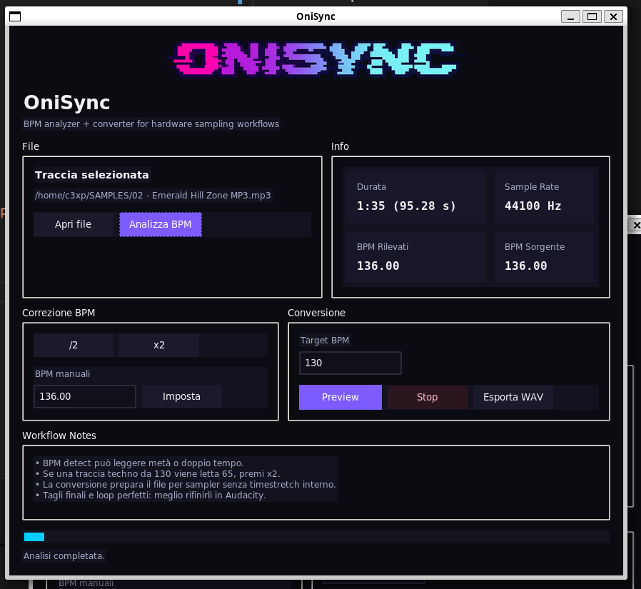

# OniSync
  
BPM Analyzer + converter + loop extractor for hardware sampling workflows

Tool minimale in Python + Tkinter per:
- caricare un file audio
- rilevare i BPM
- correggere il BPM sorgente con /2, x2 o valore manuale
- convertire il file a un BPM target
- ascoltare una preview
- esportare in WAV

## Avvio

```bash
pip install -r requirements.txt
python app.py
```

## Note

- Se l'ambiente fatica ad aprire alcuni MP3, installa anche `ffmpeg` nel sistema.
- Il logo viene caricato da `assets/logo.png`.
- Il loader è a step testuali + progress bar indeterminata.

## Screenshot
